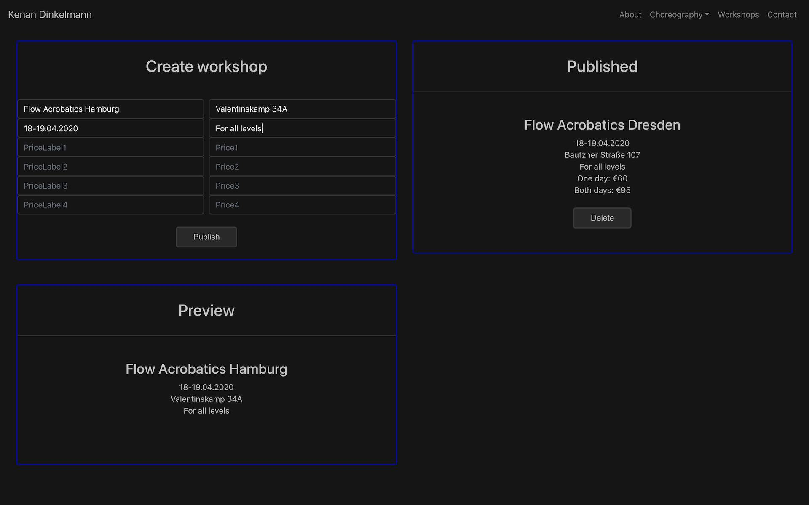

<h1 align="center">Kenan Dinkelmann Dance</h1>

## Basic Overview

Contemporary dance school web app created with React.js, Node.js and MongoDB.  
This app uses create-react-app and depends on this [backend project](https://github.com/DavideDeFeudis/kenan-backend).  
[View app](https://dev-kenandinkelmanndance.netlify.com/).

## Admin dashboard



## Installation

```bash
$ npm install
```

## Usage

```bash
$ npm start
$ npm run build
```

## Environment variables

Add .env file to the project:

```bash
REACT_APP_BACKEND_HOST=<VALUE>
REACT_APP_FIREBASE_KEY=<VALUE>
REACT_APP_FIREBASE_DOMAIN=<VALUE>
REACT_APP_FIREBASE_DATABASE=<VALUE>
REACT_APP_FIREBASE_PROJECT_ID=<VALUE>
REACT_APP_FIREBASE_STORAGE_BUCKET=<VALUE>
REACT_APP_FIREBASE_SENDER_ID=<VALUE>
```

## License
[MIT](https://choosealicense.com/licenses/mit/)
